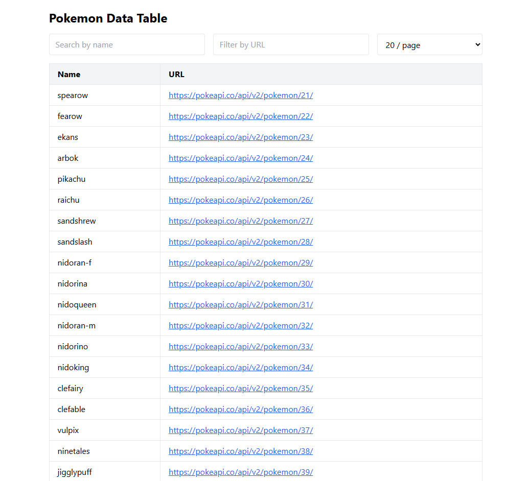
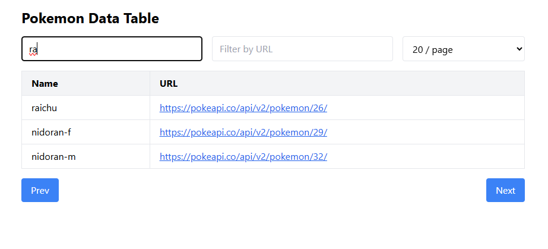
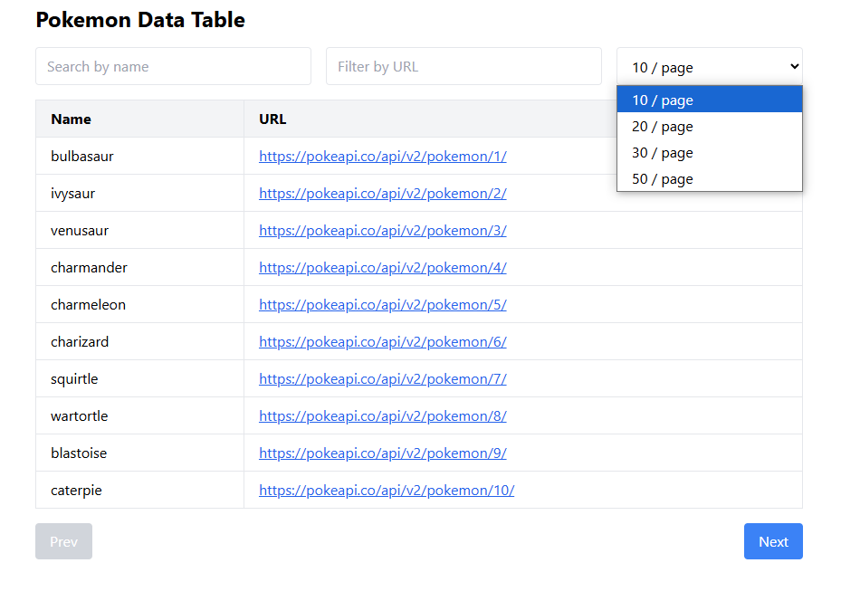

# 🧬 Pokémon Data Table App

A simple Pokémon table built with **React + TypeScript**, featuring:
- 🔍 Search by name
- 🌐 Filter by URL
- ⏮️ Pagination (Next/Prev)
- 📃 Limit per page (10 / 20 / 30 / 50)
- ⚛️ State management using **Redux Toolkit**
- 💨 Styling using **Tailwind CSS**
- 📡 Fetch data from [PokeAPI](https://pokeapi.co/)

---

## 🚀 Features

- [x] Fetch Pokémon from API
- [x] Search by name
- [x] Filter by URL
- [x] Dynamic limit per page
- [x] Pagination (offset-based)
- [x] Redux for state management
- [x] Tailwind for UI styling

---

## 🧰 Tech Stack

| Library        | Description                   |
|----------------|-------------------------------|
| React          | UI library                    |
| TypeScript     | Type-safe JavaScript          |
| Redux Toolkit  | State management              |
| Tailwind CSS   | Utility-first CSS framework   |
| Axios          | HTTP client                   |
| PokeAPI        | Public Pokémon API            |

---

## 🛠️ Installation & Usage (Local Development)

Ikuti langkah-langkah di bawah ini untuk menjalankan aplikasi di local device:

1. **Clone Repository**
git clone https://github.com/your-username/pokemon-data-table.git
cd pokemon-data-table

2. Install Dependencies
npm install
# atau jika menggunakan yarn
# yarn install

3. Start Development Server
npm run dev
# atau
# yarn dev

Buka browser dan akses http://localhost:3000

4. Berikut merupakan visual dari aplikasi jika berhasil dijalankan
- home page:

- search by name:

- modify limit/page
